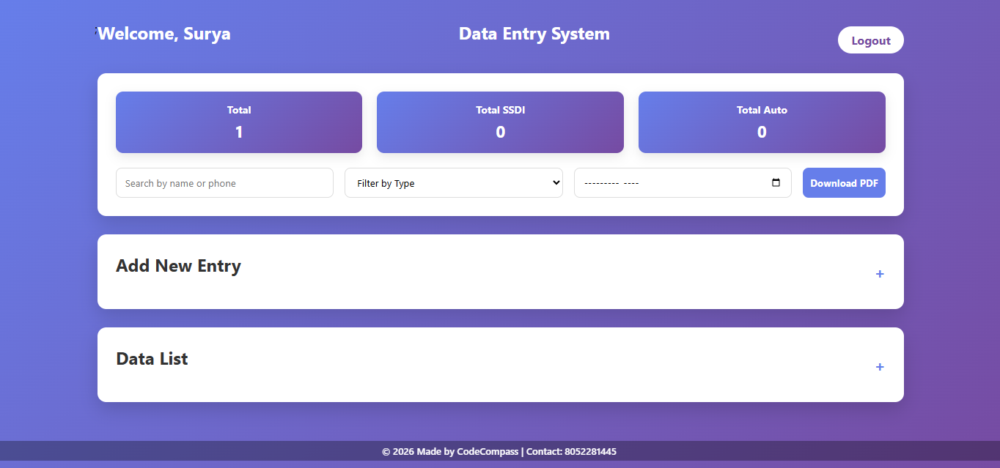

# 📊 Data Entry System

A simple **Sales/Data Entry Management System** used to record and manage customer sales details such as **phone number, name, verifier, and type of entry**.
The system helps teams easily track records, filter data, and export reports.

---

## 🌐 Live Demo

🔗 https://vulto.netlify.app/

---

## ✨ Features

* 🔐 Secure Login System
* ➕ Add New Sales/Data Entry
* 📋 View and Manage Data List
* 🔎 Search by Name or Phone Number
* 🧾 Filter by Entry Type
* 📅 Filter by Date
* 📄 Download Records as PDF
* 📊 Dashboard with Entry Statistics

---

## 🖥️ Screenshots

### Login Page

### Dashboard

---

## 📂 Data Fields

The system records the following information:

| Field         | Description                    |
| ------------- | ------------------------------ |
| Number        | Customer phone number          |
| Name          | Customer name                  |
| Verifier Name | Person who verified the entry  |
| Type          | Entry type (e.g., SSDI / Auto) |
| Date          | Date of entry                  |

---

## 🚀 How to Use

1. Open the live system link.
2. Login with your credentials.
3. Click **Add New Entry**.
4. Enter the required information.
5. Save the record.
6. View entries in the **Data List** section.

---

## 🛠 Tech Stack

* HTML
* CSS
* JavaScript
* Java
* Netlify (Hosting)

---

## 📌 Purpose

This project is designed to:

* Maintain organized sales records
* Track verified entries
* Simplify data management
* Generate downloadable reports

---

## 👨‍💻 Author

Developed by **CodeCompass**

📞 Contact: 6306108451

---

## 📄 License

This project is for **educational and internal use**.
